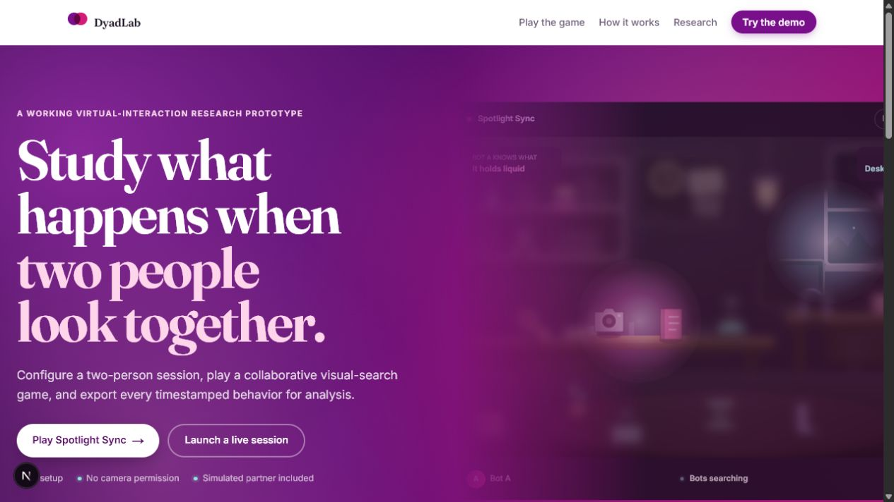
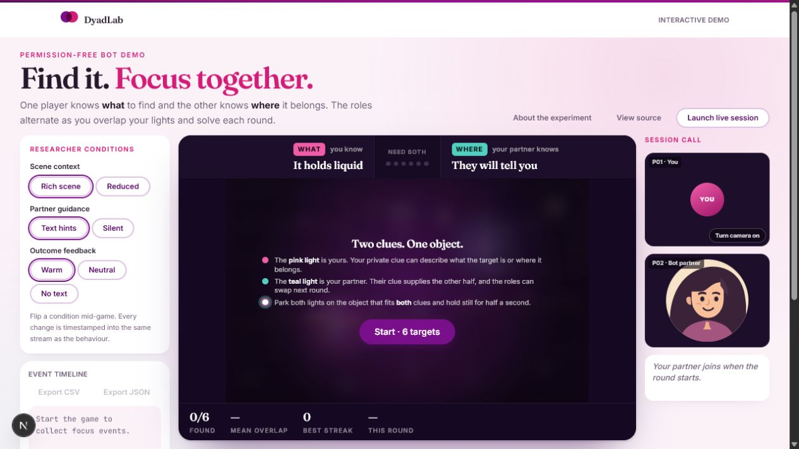
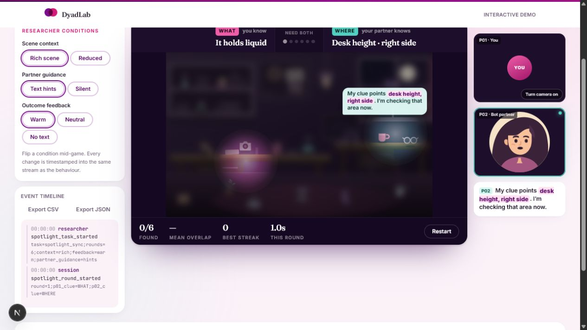
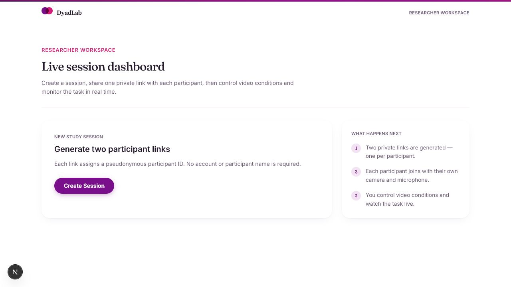

# DyadLab

**A working prototype for studying how two people interact, search, and coordinate in a virtual environment.**



DyadLab was built for Queen's University Work Study posting **FW26Q027 / 162480 — Programmer for projects focused on virtual interactions** with the [QuAD Lab](https://www.quadlab.ca/).

It turns the LATTE project brief into a working browser experience: researchers can configure a two-person session, participants can join a real audio-video call, and collaborative activity data is recorded for later analysis.

## Three connected experiences

- **Homepage (`/`)** — explains the experiment, research basis, and available workflows.
- **Spotlight Sync (`/spotlight-sync`)** — a permission-free game with a simulated partner and a replay of both search paths.
- **Researcher dashboard (`/dashboard`)** — creates persistent live sessions and private participant links.





## What the prototype demonstrates

- Real peer-to-peer audio and video with WebRTC.
- Researcher-controlled blur, grayscale, reduced frame rate, video disablement, scene context, partner guidance, and feedback.
- Six collaborative search rounds where **WHAT** and **WHERE** clues alternate between participants.
- Timestamped condition changes, focus paths, task outcomes, and CSV/JSON export.
- FastAPI signaling, SQLite event persistence, and automated browser/backend tests.



## Run locally

Start the backend:

```powershell
python -m venv .venv
.\.venv\Scripts\Activate.ps1
pip install -r backend/requirements.txt
python -m uvicorn backend.app.main:app --reload --port 8000
```

Then start the website in a second terminal:

```powershell
npm install
Copy-Item .env.example .env.local
npm run dev
```

Open [http://localhost:3000](http://localhost:3000).

## Verify

```powershell
npm run build
npm run test:backend
npx playwright install chromium
npm run test:e2e
```

The end-to-end test opens a researcher and two isolated participants, establishes the WebRTC session, applies a condition, completes Spotlight Sync, and verifies the exported data.

## Project map

```text
src/                 Next.js website, demo, dashboard, and participant session
backend/             FastAPI signaling, live session state, and SQLite storage
tests/               Full researcher + two-participant browser workflow
DESIGN.md            Product and visual-design decisions
SPOTLIGHT_SYNC.md    Game rules, measurements, and event schema
```

This is a research-software prototype, not a validated study platform. Production deployment would still require authentication, institutional security review, research ethics approval, TURN infrastructure, and an approved recording/storage policy.
